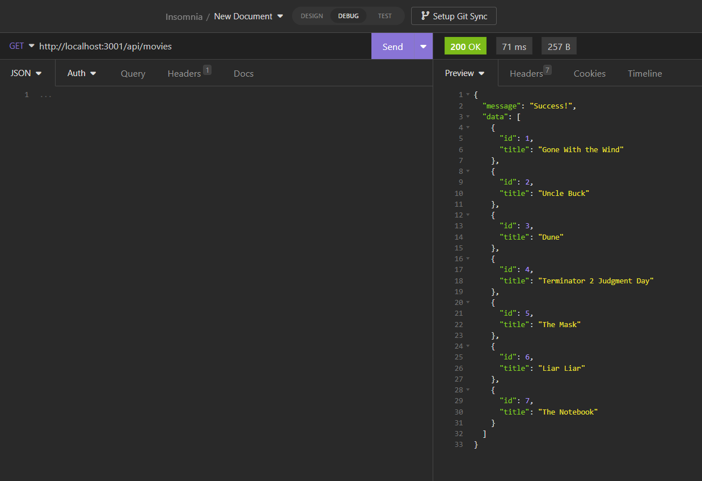

# Module 12 Mini-Project: Movie Database

In this mini-project, you will build Rest API routes for creating, retrieving, and deleting movies from a MySQL database.

;

## User Stories

* As a user, I want to create a new database.

* As a user, I want to store movie names and reviews in the database in two separate table.

* As a user, I want to see a list of all movies or look up a single movie.

* As a user, I want to be able to enter a partial movie name and have possible matches show in descending order.

* As a user, I want to be able to create and delete or update a movie.

* As a user, I want to return a list of all the reviews and the associated movie name.

* As a user, I want to be able to update a review.

## Acceptance Criteria

* It's done when `movie_db` is created and contains a `movies` and `reviews` table.

* It's done when `movie_db` has been seeded with data.

* It's done when the `/api/movies` route renders a list of all movies.

* It's done when the `/api/movies/:id` route renders a single movie.

* It's done when the `api/reviews/:movie` route provides a possible list of movie titles when a partial movie name is entered.

* It's done when the `/api/movies` route successfully adds a movie when tested using Insomnia.

* It's done when the `/api/update/:id` route allows the user to update a movie.

* It's done when the `/api/reviews` route shows all the reviews.

* It's done when the `/api/reviews/:id` route successfully updates a review when tested using Insomnia.

* It's done when the `/api/delete/:id` route deletes a movie when tested using Insomnia.